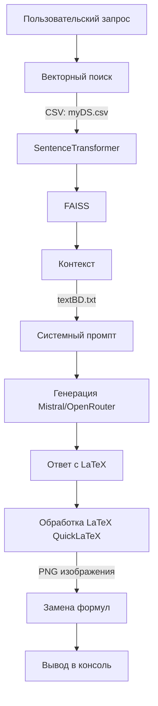

# diplom_st_1

```mermaid
graph TD
    A[Пользовательский запрос] --> B[Векторный поиск]
    B -->|CSV: myDS.csv| C[SentenceTransformer]
    C --> D[FAISS]
    D --> E[Контекст]
    E -->|textBD.txt| F[Системный промпт]
    F --> G[Генерация Mistral/OpenRouter]
    G --> H[Ответ с LaTeX]
    H --> I[Обработка LaTeX QuickLaTeX]
    I -->|PNG изображения| J[Замена формул]
    J --> K[Вывод в консоль]
```
