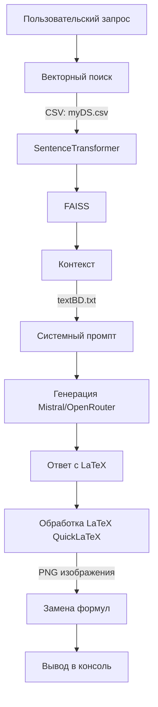

# diplom_st_1

### Подмножества множеств

1. Пустое множество:
   - Строчная формула: $P(\emptyset) = \{\emptyset\}$
   - Блочная формула:
     $$P(\emptyset) = \{\emptyset\}$$

2. Множество $\{1, 2, 3\}$:
   - Все подмножества:
     $$P(\{1, 2, 3\}) = \{\emptyset, \{1\}, \{2\}, \{3\}, \{1, 2\}, \{1, 3\}, \{2, 3\}, \{1, 2, 3\}\}$$
