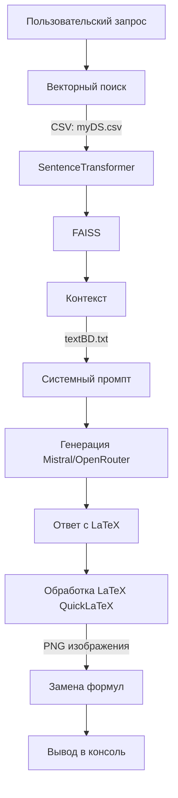

# diplom_st_1

### Подмножества множеств
Номер_задачи|Подзадача|Текст_задачи|Тематика|Решение
1||Найти все подмножества следующих множеств: ∅, {∅}, {1, 2, 3}, {a, {1, 2}, ∅}.|Множества, отношения и функции|P(∅) = {∅}, P({∅}) = {∅, {∅}}, P({ 1, 2, 3 }) = {∅, {1}, {2}, {3}, {1, 2}, {1, 3}, {2, 3}, {1, 2, 3}}, P({a, {1, 2}, ∅}) = {∅, {a}, {{1, 2}}, {∅}, {a, {1, 2}}, {a, ∅}, {{1, 2}, ∅}, {a, {1, 2}, ∅}}.
2||Дано множество A = {0, {0, 1, 2}, {3}, 4, {{5}}, 6}. Определить, какие из следующих множеств B = {0, 4}, C = {6, {3}, 0}, D = {0, 3}, E = {{0, 1, 2}, {3}}, F = {0, {5}}, G = {{3}, 2, {{5}}, 6} не являются ~ подмножествами A?|Множества, отношения и функции|D, F и G.
3||Даны множества: \( A = \{a, b, \{\emptyset\}, \{a, c, d\}\}, B = \{a, c, e, \{a\}, \{b\}\} \) и \( C = \{a, b, c, d, \{e\}, \emptyset\} \). Найти множество \( D = (A \cup B) \setminus C \). Какова его мощность?|Множества, отношения и функции|(A \cup B) \setminus C = \{\{\emptyset\}, \{a, c, d\}, e, \{a\}, \{b\}\}, \mid (A \cup B) \setminus C \mid = 5.
4||Даны множества: \( A = \{a, b, c, \{\emptyset\}, \{a\}\}, B = \{a, e, \{a\}, \{b\}, \emptyset\} \) и \( C = \{a, b, d, \{e\}, \{\emptyset\}\} \). Найти множество \( D = (A \setminus B) \cap C \). Какова его мощность?|Множества, отношения и функции|(A \setminus B) \cap C = \{b, \{\emptyset\}\}, \mid(A \setminus B) \cap C\mid = 2.
5||Пусть \( A = \{0, 1\}, B = \{a, b, c\} \). Найти множества \( A \times B \) и \( B \times A \)|Множества, отношения и функции|A \times B = \{(0, a), (0, b), (0, c), (1, a), (1, b), (1, c)\}, B \times A = \{(a, 0), (a, 1), (b, 0), (b, 1), (c, 0), (c, 1)\}.
