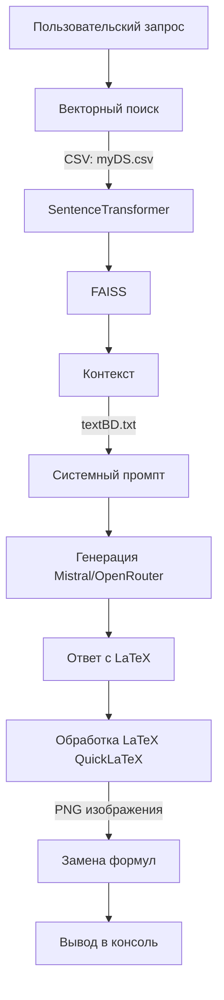

# diplom_st_1

### Подмножества множеств
# Задачи по множествам, отношениям и функциям

## Задача 1
- **Номер задачи**: 1
- **Подзадача**: 
- **Текст задачи**: Найти все подмножества следующих множеств: ∅, {∅}, {1, 2, 3}, {a, {1, 2}, ∅}.
- **Тематика**: Множества, отношения и функции
- **Решение**: 
  - 
  - 
  - 
  - 

## Задача 2
- **Номер задачи**: 2
- **Подзадача**: 
- **Текст задачи**: Дано множество A = {0, {0, 1, 2}, {3}, 4, {{5}}, 6}. Определить, какие из следующих множеств B = {0, 4}, C = {6, {3}, 0}, D = {0, 3}, E = {{0, 1, 2}, {3}}, F = {0, {5}}, G = {{3}, 2, {{5}}, 6} не являются ~ подмножествами A?
- **Тематика**: Множества, отношения и функции
- **Решение**: D, F и G.

## Задача 3
- **Номер задачи**: 3
- **Подзадача**: 
- **Текст задачи**: Даны множества:  и . Найти множество . Какова его мощность?
- **Тематика**: Множества, отношения и функции
- **Решение**: , .

## Задача 4
- **Номер задачи**: 4
- **Подзадача**: 
- **Текст задачи**: Даны множества:  и . Найти множество . Какова его мощность?
- **Тематика**: Множества, отношения и функции
- **Решение**: , .

## Задача 5
- **Номер задачи**: 5
- **Подзадача**: 
- **Текст задачи**: Пусть . Найти множества  и .
- **Тематика**: Множества, отношения и функции
- **Решение**: , .
